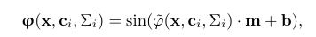

# Reproduction and ablation study of "NeuRBF: ANeural Fields Representation with Adaptive Radial Basis Functions"

This blog post documents the reproduction and ablation study from group 42* as part of the CS4240 Deep Learning 2023–24 course.

| Authors            | Student number |
| ------------------ | -------------- |
| Levijn de Jager    | 4903668        |
| Roan van der Voort | 4646452        |
| Jimmie Kwok        | Placeholder    |
| Kunal Kaushik      | Placeholder    |

## Introduction

## Dataset

subset of LIU-4k-V2

## RBF Functions

In the paper only one RBF (Radial Basis Function) is tested. It is however acknowledged that this method extends to any generic RBF and that certain types of images can benefit from different RBFs. In order to investigate this We chose several different RBFs to try out on a random subset of images from our dataset.

<!-- rbf_types = ["ivq_a", "nlin_f", "ivmq_a", "gauss_a", "mqd_a", "expsin_a"] -->

## Sinusoidal composition
The paper extends the radial basis function by adding a sinusoidal composition on the the radial basis with different frequencies. The formulation is as follows:

The different frequencies are determined by setting a maximum and minimum for m. The rest of the elements are obtained by log-linearly dividing the range between the maximum and minimum. Comparing this to the fourier basis or gabor basis seen in the figure it is now possible to have a basis with non-linear paterns.

The sinusoidal composition method is also applied to the output of the first fully connected layer in the MLP. The output is then used as the input for the next layer. 

They claim that using these sinusoidal compositions improve the performance. They also documented the results they got with and without these additional compositions and we want to check these results by doing the same ablation study and compare our results but with a different dataset. 

Our results can be seen in the table below:
| Method                      | Our Average PSNR | Their Average PSNR |
| --------------------------- | ---------------- | ------------------ |
| With Sinusoidal composition | 0                | 0                  |
| Only on feature vector      | 0                | 0                  |
| Only on RBF function        | 0                | 0                  |
| No Sinusoidal composition   | 0                | 0                  |