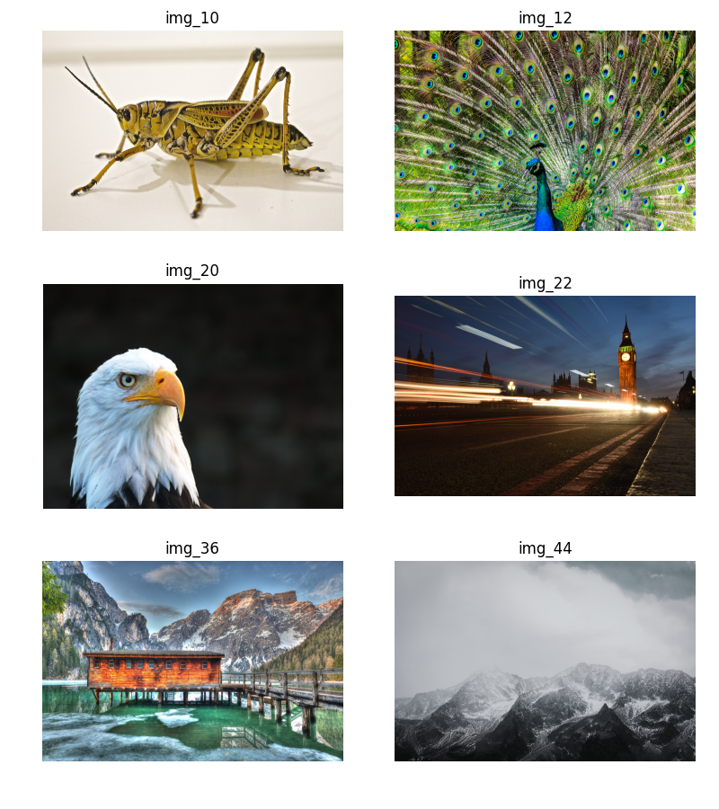

# Reproduction and ablation study of "NeuRBF: A Neural Fields Representation with Adaptive Radial Basis Functions"

This blog post documents the results of the reproduction and ablation study of Group 42 as part of the CS4240 Deep Learning 2023-24 course.

| Authors            | Student number | Responsible for        |
| ------------------ | -------------- | ---------------------- |
| Levijn de Jager    | 4903668        | Sinusoidal composition |
| Roan van der Voort | 4646452        | RBF functions          |
| Jimmie Kwok        | 5410908    |    2D Image Fitting, Results Processing                    |
| Kunal Kaushik      | 6050549    |    Hidden Dimensions, Presence of grid-based RBFs                     |

## Introduction

Neural fields make use of Neural Networks to form neural representations, which map continuous input values to outputs for the purpose of various tasks such as representing 2D images and 3D reconstruction. Neural fields evolved from using global neural features into local neural fields, which utilise grid-like structures to organise local neural features and interpolate linearly to sum up the local features. However, there still remain issues in achieving desired accuracy and compactness with grid-like structures, due to their unadaptive nature to target signals and inability to completely utilise non-uniformity and sparsity for many tasks. The purpose of the authors in this work [[1]](#1) is to enhance the representation abilities of neural fields. They do so by introducing spatial adaptivity and frequency extension in the interpolation of basis functions. Grid-based linear interpolation is in a sense a type of Radial Basis Function (RBF). RBFs can reduce the number of parameters required for representations, and hence the authors proposed NeuRBF, which combines adaptive and grid-based RBFs. The RBFs are extended channel-wise and utilise multi-frequency sinusoidal composition, increasing representation capabilities by allowing the RBFs to encode a bigger range of frequencies without the cost of needing more parameters. A weighted scheme for K-Means is used for kernel parameter initialisation to help RBFs adapt to different target signals, and for Neural Radiance Field (NeRF) reconstruction, a distillation based approach is also made use of. The authors claim to have achieved state of the art accuracy on 2D image fitting, 3D signed distance field reconstruction, and NeRF reconstruction. For the purposes of our reproducibility studies, we focus only on 2D image fitting. We will reproduce the rightmost column of image 4 from the original paper, and vary the value of various parameters in the implementation of NeuRBF to study the effect on the results, and also compare to some ablation results for image fitting that the authors have provided in the original paper as well.

## Dataset

subset of LIU-4k-V2 [[2]](#2)

## 2D Image Fitting
We evaluated the effectiveness of NeuRBF on 2D image fitting by reproducing the error map of the two fitted images shown in Figure 4 of [[1]](#1). The error map is defined as the error between the original image and the reconstructed image by NeuRBF, which is calculated as the mean absolute error across the color channels for each pixel (range of pixel value is [0, 1]). The left column of the figure below shows the paper’s results of the image fitting and the right column displays the results of our implementation. Below each error map the following is reported: the number of training parameters (in M/Millions) used by NeuRBF and the Peak Signal-to-Noise Ratio (PSNR) of the reproduced figure (in dB). The formula for the PSNR [[3]](#3) is given by the equation below:

$$
    PSNR = 10\log_{10}(\frac{R^2}{MSE})
$$

The R term in the formula is the maximum signal value in our input image data, which is 255 in our case. The MSE is the mean squared error between the reconstructed and the original image. 

In general, for the image fitting it is desired to achieve a lower number of training parameters and a higher PSNR as a higher PSNR indicates a better quality of the reconstructed image. The first figure (first row) is titled ‘The Trekvliet Shipping Canal near Rijswijk’, known as the ‘View near the Geest Bridge’ and obtained from [[4]](#4). However, the authors of the paper failed to include the title of the figure or the corresponding reference. The second figure was provided by the authors via their Github page [[5]](#5) and is a picture of the dwarf planet Pluto. For the first image of the canal, the number of training parameters of our reproduction is almost the same as what the authors obtained. However, the PSNR of our reproduced canal image is much lower than expected. This could be due to various reasons. As mentioned earlier we could not find the exact source of their used canal image, but we did find an identical image with the same size. Furthermore, in the error map we can see a lot of those 'weird' error lines which may be caused by JPEG artifacts as our original image had been compressed and saved in the .jpg format. For the Pluto image, the reported number of training parameters and PSNR of our reproduction are very similar to the authors’ results.

## Normalization 
The RBF function plays a significant role in NeuRBF as will be highlighted later in this blog post. The paper states that the radial base value (calculated by the RBF function) at each point can be optionally normalized via the following equation:

$$
\tilde{\varphi}(x, c_i, \Sigma_i) = \frac{\varphi(x, c_i, \Sigma_i)}{\sum_{k \in U(x)}\varphi(x, c_i, \Sigma_i)}
$$

where $\varphi(x, c_i, \Sigma_i)$ corresponds to the used RBF function and $U(x)$ refers to the set of neighboring RBFs of the point x.

We wanted to investigate the effect of this normalization, because the authors mentioned that they deemed it as an optional step without providing any further explanation. The effect is investigated by conducting an ablation study on normalization, where the results of this ablation is shown by the table below:

| Method                        | Average PSNR | 
| ----------------------------- | ---------------- | 
| With Normalization                      |   41.45          | 
| No Normalization    |   41.31         | 

Based on the ablation study above, we can conclude that removing the normalization has little to no effect on the average PSNR achieved by NeuRBF.

## Effect of hidden dimensions
The MLP network as described in the original paper has 2 hidden layers and 1 output layer, with 64 neurons in the hidden layers, described by the . We provide the results for changing the number of neurons in the hidden layers to 16 and 32. Testing the outputs corresponding to having a lesser number of neurons in the hidden layers of the MLP helps us evaluate if we can potentially use a lesser number of parameters in our network while maintaining a similar level of performance. The idea is that it can help us save computational time. This is exactly what we observe, and the results are provided below. We can see that reducing the number of neurons to 32 reduces the computational time by ~10%, and actually gives us a slightly better psnr than the base. Reducing the number of neurons to 16 reduces the computational time by nearly a further 5 percent, with only a slight drop in the psnr value. The reduction in training time is expected, given a reduction in the number of trainable paramaters. We were surprised by getting nearly the same psnr value with a succesive halving of the number of neurons in the hidden layers, having expected a more noticeable drop. This opens possibilities of adding more complexity in the overall structure where the performance increase at the cost of increase in computational time is more reasonable.

| Method                        | Our Average PSNR |    Training time   |
| ----------------------------- | ---------------- | ------------------ |
| Base (hidden_dim=64)          |   41.44          |   160.53s          |
| hidden_dim = 16               |   40.99          |   139.86s          |
| hidden_dim = 32               |   41.47          |   145.50s          |

## Presence of grid-based RBFs
The original paper implements a combination of grid-based rbfs and adaptive rbfs. We study the results of dropping the grid-based rbfs from the implementation in hope of observing the same effect as with the number of neurons in the hidden layers of the MLP. As far as the computational time is observed, we do observe a drop of nearly 5% compared to using a combination of both grid based and adaptive rbfs. Unfortunately, this also occurs with a drop in psnr of nearly 1.7. The results are shown below. This leads us to believe that for optimal performance, the combination of both grid-based and adaptive rbfs is necessary.

| Method                        | Our Average PSNR |    Training time   |
| ----------------------------- | ---------------- | ------------------ |
| Base (hidden_dim=64)          |   41.44          |   160.53s          |
| num_levels=0                  |   39.77          |   153.85s          |

## Sinusoidal composition
The paper extends the radial basis function by adding a multi-frequency sinusoidal composition (MSC) on the the radial basis with different frequencies. The formulation is as follows:

$\varphi (\mathbf{x},\mathbf{c}_i,\Sigma _i)=sin(\widetilde{\varphi} (\mathbf{x},\mathbf{c}_i,\Sigma _i)\cdot \mathbf{m}+\mathbf{b})$

The different frequencies are determined by setting a maximum and minimum for m. The rest of the elements are obtained by log-linearly dividing the range between the maximum and minimum. Comparing this to the fourier basis or gabor basis seen in the figure it is now possible to have a basis with non-linear paterns.

The sinusoidal composition method is also applied to the output of the first fully connected layer in the MLP. The output is then used as the input for the next layer. 

They claim that using these sinusoidal compositions improve the performance. They also documented the results they got with and without these additional compositions and we want to check these results by doing the same ablation study and compare our results but with a different dataset. 

Our results can be seen in the table below. On the left are our results on our own dataset of 50 high resolution images. On the right are the results from the ablation study from the paper itself. They used a dataset of 100 images.
| Method                        | Our Average PSNR | Their Average PSNR |
| ----------------------------- | ---------------- | ------------------ |
| With MSC                      |   41.45          | 51.53              |
| MSC only on feature vector    |   39.76          | 48.19              |
| MSC only on RBF function      |   42.38          | 48.46              |
| No MSC                        |   39.96          | 43.81              |

Firstly, the PSNR values between our ablation study and theirs is very different. They report a lot higher values in general. Moreover, our results show that the MSC on the RBF has a bigger influence on the results then MSC on the feature vector whilest they report about the same amount of influence of the MSC on the RBF and the feature vector on the results.

We are not exaclty sure why these differ so much, but we have some speculations that might explain these differences. The difference in general results might be because of the difference in the dataset but that would mean that it is not a very generilizable method. Furthermore, the paper states that using different RBF kernels can give better results in specific image cases. So this might also explain the possible difference between the MSC on the RBF function and the MSC on the feature vector, as it is possible that the MSC on the RBF has more influence on our dataset then theirs. We further explore the different kernels later in this blog post.

## Effect of the RBF Function on image representation performance

The paper we are examining here is about the use of radial basis functions in for learning feature representation of image and higher higher dimensional data such as SDFs and radiance fields. They recognise that the gridbased weighted linear interpolation method of Local Neural Fields can be viewed as a special case os a radial basis function. From this then follow the main contribution of this paper which is to present a framework to which uses adaptive RBFs to find a representation, called Neural Radial Basis Fields. Adaptive RBFs are not locked to a grid as they have additional position and shape parameters.

The paper however only uses one RBF throughout the paper as an example of this method, the inverse multi quadratic function.
$$\varphi(\mathbf{x},\mathbf{c}_{i},\Sigma_{i})={\frac{1}{1+(\mathbf{x}-\mathbf{c}_{i})^{T}\Sigma_{i}^{-1}(\mathbf{x}-\mathbf{c}_{i})}}$$
Besides the inverse multiquadratic many more Radial Basis Functions exist and may have varying performance depending on the exact case. This is also acknowledged within the paper but not expanded upon.

This led to two questions. First does the choice of RBF significantly matter for the result. Second, did their example choice of RBF significantly influence their results.

### setup of experiment

To investigate the questions. We decided to test five different RBFs besides the RBF used in the paper on six images we selected to be very different, based on amount of detail, background, subject, lighting conditions. We recognize this is only a small sample size, but this was chosen to stay within time and compute constraints.

#### RBFs

In total six RBFs were tested, these and the reasoning being:

- Inverse quadratic: This is the example function they use. The basic formula for this functionis: $\frac{1}{1+(x-kc)^2*ks}$
- Gaussian: A very well understood RBF from literature and often implemented. the basic formula for this functionis: 
- Inverse multiquadratic: This and the non inverse variant too are also often used in literature. 
- multiquadratic:
- Non linear: This function is a linear fall-off about a center point up to a distance away from it which is dependent on the weight. When used in a regular grid without the adaptive parameters this function is the same as a Local Neural Field. Making it interesting to see how this performs against more smooth RBFs
- Exponential Sine: this function is a periodic function which may capture a periodic signal better and could therefore perform better in certain cases.

In all cases the adpative variants with anisotropic shape parameters were used. This was done to remain consistent with the results presented in the paper.

The 3d plots of each RBF function with a identity matrix as shape parameter.

#### Images

For this analysis the following images were selected from the dataset referred to earlier. 
These images were selected due to their variety. Some have high frequencie detail, some have large solid backgroudns, and some have parts of the image which are out of focus. While this is not an exhaustive set, we expect it to proide enough variety to be able to make a qualatative assesment.

#### Method of testing
The images are encoded using the selected RBFs as basis functions. This is then used to generate a new image. Between the original and the result an error map is calculated as well as a PSNR. Each NeuRBF was trained using the same settings as their ablation studies, with 3500 epochs. All other settings were left at default. 

### results & discussion

notes on the results:
- visually the errormaps seem to indicate that the choice of RBF makes a large difference
- For each image a different RBF produces the best result
- For some images the resulting PSNR is fairly close, within 3dB. While for, for example img_44, the resulting PSNR differs by almost 6dB.
- There chosen method, inverse qudratic (ivq_a), is only the best for one image from this set, but seems to perform reasonably well for most of them. 

First does the choice of RBF significantly matter for the result. Second, did their example choice of RBF significantly influence their results.

To come to the answers to the questions we were intersted in. First, does the choice of RBF significantly matter for the result. Yes, it definitly seems to matter what RBF is used when the training epochs is limited. It maybe the case that with more epoch they all settle to an equal PSNR, but this was not investigated here. Additionally the content of the image also plays a role in how an RBF performs. With additional data it may be possible to infere from image characteristics what RFS would perfrom well.
The second question, did their choice of RBF onfluence their results. Looking at this limted sample set we don't think their results were negatively impacted by the choice of RBF. While the inverse quadratic doesn't perform the best for each image in the sample size tested it does seem to perform fairly consistently well across the sample dataset, compared to the other RBFs. 

While this analysis wasn't exhaustive, it does show the potential of the NeuRBF method when using different RBFs. 

## Conclusion and final remarks
We have been reasonably able to to reproduce the results provided in the original paper, whilse successfully providing some new insight into the effect of ablating certain parameters. In conclusion, we would like to remark that while the code was not hard to reimplement, it was a little hard to understand what was going on in certain parts of the code, and maybe more comments would be helpful. Also, in the paper itself, at certain points, more detail could have been provided, and in the form the paper has actually been written, it assumes a great amount of prior knowledge.

## References

<a id="1">[1]</a> 
Chen, Z., Li, Z., Song, L., Chen, L., Yu, J., Yuan, J., & Xu, Y. (2023). Neurbf: A neural fields representation with adaptive radial basis functions. In Proceedings of the IEEE/CVF International Conference on Computer Vision (pp. 4182-4194).

<a id="2">[2]</a> 
Liu, J., Liu, D., Yang, W., Xia, S., Zhang, X., & Dai, Y. (2019). A Comprehensive Benchmark for Single Image Compression Artifacts Reduction. In arXiv.

<a id="3">[3]</a>
Hore, A., & Ziou, D. (2010, August). Image quality metrics: PSNR vs. SSIM. In 2010 20th international conference on pattern recognition (pp. 2366-2369). IEEE.

<a id="4">[4]</a>
Weissenbruch, J. H. (1868). The Trekvliet Shipping Canal near Rijswijk, known as the ‘View near the Geest Bridge’ [Painting]. Rijksmuseum. http://hdl.handle.net/10934/RM0001.COLLECT.6531

<a id="5">[5]</a>
NeuRBF. GitHub. https://github.com/oppo-us-research/NeuRBF
