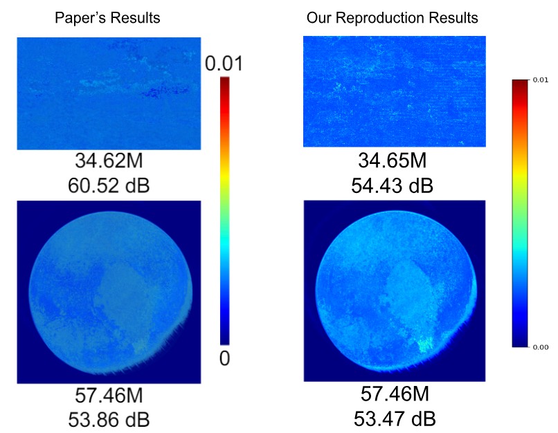

# Reproduction and ablation study of "NeuRBF: ANeural Fields Representation with Adaptive Radial Basis Functions"

This blog post documents the reproduction and ablation study from group 42* as part of the CS4240 Deep Learning 2023-24 course.

| Authors            | Student number | Responsible for        |
| ------------------ | -------------- | ---------------------- |
| Levijn de Jager    | 4903668        | Sinusoidal composition |
| Roan van der Voort | 4646452        | RBF functions          |
| Jimmie Kwok        | 5410908    |    2D Image Fitting, Results Processing                    |
| Kunal Kaushik      | Placeholder    |                        |

## Introduction

## Dataset

subset of LIU-4k-V2

## 2D Image Fitting
We evaluated the effectiveness of NeuRBF on 2D image fitting by reproducing the error map of the two fitted images shown in Figure 4 of [ref paper]. The error map is defined as the error between the original image and the reconstructed image by NeuRBF, which is calculated as the mean absolute error across the color channels for each pixel (range of pixel value is [0, 1]). The left column of the figure below shows the paper’s results of the image fitting and the right column displays the results of our implementation. Below each error map the following is reported: the number of training parameters (in M/Millions) used by NeuRBF and the Peak Signal-to-Noise Ratio (PSNR) of the reproduced figure (in dB). The formula for the PSNR is given by Equation (1):

$
\begin{equation}
    PSNR = 10\log_{10}(\frac{R^2}{MSE})
\end{equation}
$

The R term in the formula is the maximum signal value in our input image data, which is 255 in our case. The MSE is the mean-square error between the reconstructed and the original image. 

In general, for the image fitting it is desired to achieve a lower number of training parameters and a higher PSNR as a higher PSNR indicates a better quality of the reconstructed image. The first figure (first row) is titled ‘The Trekvliet Shipping Canal near Rijswijk’, known as the ‘View near the Geest Bridge’ and obtained from [ref]. However, in the paper the authors did not mention the title of the figure or the reference. The second figure was provided by the authors via their Github page and is a picture of the dwarf planet Pluto. For the first image of the canal, the number of training parameters of our reproduction is almost the same as what the authors obtained. However, the PSNR of our reproduced canal image is much lower than expected. This could be due to various reasons. As mentioned earlier we could not find the exact source of their used canal image, but we did find the same image with the same size. Furthermore, in the error map we can see a lot of those 'weird' error lines which may be caused by JPEG artifacts as our original image had been compressed and saved in the .jpg format. For the Pluto image, the reported number of training parameters and PSNR of our reproduction are very similar to the authors’ results.

## RBF Functions

In the paper only one RBF (Radial Basis Function) is tested. It is however acknowledged that this method extends to any generic RBF and that certain types of images can benefit from different RBFs. In order to investigate this We chose several different RBFs to try out on a random subset of images from our dataset.

<!-- rbf_types = ["ivq_a", "nlin_f", "ivmq_a", "gauss_a", "mqd_a", "expsin_a"] -->

## Sinusoidal composition
The paper extends the radial basis function by adding a multi-frequency sinusoidal composition (MSC) on the the radial basis with different frequencies. The formulation is as follows:

The different frequencies are determined by setting a maximum and minimum for m. The rest of the elements are obtained by log-linearly dividing the range between the maximum and minimum. Comparing this to the fourier basis or gabor basis seen in the figure it is now possible to have a basis with non-linear paterns.

The sinusoidal composition method is also applied to the output of the first fully connected layer in the MLP. The output is then used as the input for the next layer. 

They claim that using these sinusoidal compositions improve the performance. They also documented the results they got with and without these additional compositions and we want to check these results by doing the same ablation study and compare our results but with a different dataset. 

Our results can be seen in the table below. On the left are our results on our own dataset of 50 high resolution images. On the right are the results from the ablation study from the paper itself. They used a dataset of 100 images.
| Method                        | Our Average PSNR | Their Average PSNR |
| ----------------------------- | ---------------- | ------------------ |
| With MSC                      |   41.45          | 51.53              |
| MSC only on feature vector    |   39.76          | 48.19              |
| MSC only on RBF function      |   42.38          | 48.46              |
| No MSC                        |   39.96          | 43.81              |

Firstly, the PSNR values between our ablation study and theirs is very different. They report a lot higher values in general. Moreover, our results show that the MSC on the RBF has a bigger influence on the results then MSC on the feature vector whilest they report about the same amount of influence of the MSC on the RBF and the feature vector on the results.

We are not exaclty sure why these differ so much, but we have some speculations that might explain these differences. The difference in general results might be because of the difference in the dataset but that would mean that it is not a very generilizable method. Furthermore, the paper states that using different RBF kernels can give better results in specific image cases. So this might also explain the possible difference between the MSC on the RBF function and the MSC on the feature vector, as it is possible that the MSC on the RBF has more influence on our dataset then theirs. We further explore the different kernels later in this blog post.

## References